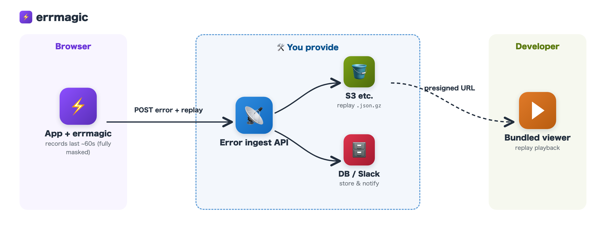
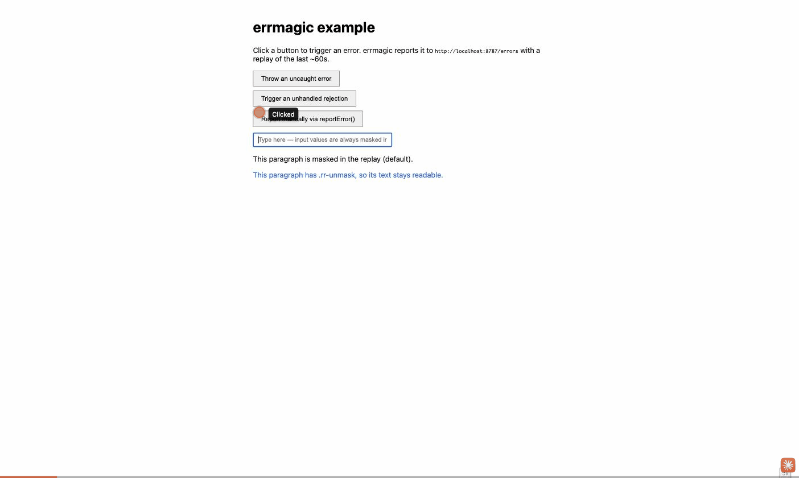

# errmagic

**English** | [日本語](README.ja.md)

A Sentry-like browser error reporter with no external SaaS. It captures browser JS errors and POSTs them to any endpoint you own, attaching an rrweb session replay of the last ~60 seconds. `dist/` is committed, so it installs directly as a git dependency (no `prepare` build needed).

## Architecture

errmagic is a client-side (browser) library. **You provide the ingest API and the replay storage on your own infrastructure.**



### Required infrastructure

| Component | Required | Role |
|---|---|---|
| Error ingest API | ✅ | The POST endpoint you pass as `endpoint`. Implements the responsibilities described in "What your API must do" below |
| Object storage (S3 etc.) | If you use replays | Stores the replay as `.json.gz`. The viewer reads it via a presigned URL |
| Error storage / notification (DB / logs / Slack etc.) | Optional | Persisting, searching, and alerting on errors. Entirely up to you |

Any vendor works — the S3 part can be GCS / R2 / anything that can issue presigned-URL equivalents.

### Examples

[`examples/`](examples/README.md) contains a minimal end-to-end setup: a Vite frontend with errmagic integrated, a Hono ingest API (stores replays on local disk), and Terraform for the S3 replay bucket. The front + api pair runs entirely on your machine — report an error, then play back the saved replay with the bundled viewer.

## Installation

```bash
pnpm add github:sgash708/errmagic#v0.1.0
```

If you use the React ErrorBoundary (`errmagic/react`), `react >=18` is an optional peerDependency.

## Usage

```ts
import { initErrmagic, reportError } from "errmagic";

initErrmagic({
  endpoint: "https://api.example.com/errors",
  app: "my-app",
  // replay?: boolean;              // default true
  // dedupeWindowMs?: number;       // default 300_000 (5 min)
  // beforeSend?: (report) => report | null; // return null to cancel sending
});

// window.onerror / unhandledrejection are captured automatically.
// To report manually:
try {
  doSomething();
} catch (err) {
  reportError(err, { userId: "123" });
}
```

### React ErrorBoundary

```tsx
import { ErrmagicErrorBoundary } from "errmagic/react";

function App() {
  return (
    <ErrmagicErrorBoundary>
      <YourApp />
    </ErrmagicErrorBoundary>
  );
}
```

Pass a `fallback` prop to render your own element instead of the default minimal error screen (with a reload button).

## Payload

```jsonc
POST {endpoint}  Content-Type: application/json
{
  "app": "my-app",
  "name": "TypeError",
  "message": "Cannot read ...",         // truncated to 2000 chars
  "stack": "TypeError: ...\n at ...",   // truncated to 20000 chars
  "url": "https://app.example.com/...",
  "user_agent": "Mozilla/...",
  "occurred_at": "2026-07-15T00:00:00.000Z",
  "replay": "<base64(gzip(JSON.stringify(rrweb events)))>", // null if absent
  "replay_format": "rrweb-gzip-base64"                       // null if replay is null
}
```

## What your API must do

These are the responsibilities of the ingest API you pass as `endpoint`.

1. **Receive and validate the payload**: accept the JSON above and validate e.g. that `app` is an expected app name.
2. **Store the replay**: base64-decoding `replay` yields a gzip binary as-is, so store it **without decompressing** as `.json.gz` in object storage (the format the viewer reads). Keep the object key associated with the error record.
3. **Store / notify the error itself**: save `name` / `message` / `stack` / `url` etc. to a DB, notify Slack, and so on — entirely up to you.
4. **Respond**: the client is fire-and-forget (it never reads the response), so `204 No Content` is enough. Returning an error does not trigger a retry.

```ts
// Example (Hono + AWS SDK v3)
app.post("/errors", async (c) => {
  const report = await c.req.json();
  if (report.app !== "my-app") return c.body(null, 400);

  let replayKey: string | null = null;
  if (report.replay) {
    replayKey = `${report.app}/${crypto.randomUUID()}.json.gz`;
    await s3.send(new PutObjectCommand({
      Bucket: "your-error-replay-bucket",
      Key: replayKey,
      Body: Buffer.from(report.replay, "base64"), // just decode — do not decompress
      ContentType: "application/gzip",
    }));
  }

  await db.insert(errors).values({ ...pick(report), replayKey });
  return c.body(null, 204);
});
```

### Operational notes

- **Request body size limit**: a `replay` can be hundreds of KB to a few MB even after compression. Check the body size limits of your API (API Gateway / nginx / framework defaults). Returning 413 on overflow does not break the client (failures are swallowed).
- **CORS**: if the endpoint lives on a different origin than your app, you need a CORS configuration allowing `POST` with `Content-Type: application/json`.
- **Abuse protection**: the endpoint is a public URL callable from any browser, so consider rate limiting, validating the `app` name, and checking the Origin header.
- **Duplicates**: the client dedupes for 5 minutes, but the same error hitting multiple users arrives once per user. Aggregation and grouping are the server's responsibility.

## Masking policy (privacy)

- **All text and all input values are masked by default** (`maskAllInputs: true` / `maskTextSelector: '*'`).
- `img,video,canvas` are blocked (`blockSelector`) and never appear in the replay.
- Add the `.rr-unmask` class only to elements whose text may be unmasked. Nothing else can be unmasked.
- Input values (input/textarea etc.) can never be unmasked (`maskAllInputs: true` is fixed).

```html
<!-- Only text under this div stays unmasked in the replay -->
<div class="rr-unmask">Text that is safe to expose</div>
```

## Other behavior

- Identical errors are deduped client-side for **5 minutes** (`dedupeWindowMs`) and not re-sent.
- A replay is attached **only once per session per error key** (subsequent reports are sent without a replay).
- On browsers without `CompressionStream`, errors are sent without a replay.
- The reporter itself never throws and never breaks your app (send failures are swallowed).

## Replay viewer

`viewer/index.html` is a single HTML file that plays replays locally with rrweb-player (CDN). No server needed.



1. Open `viewer/index.html` directly in a browser
2. Issue a presigned URL for a replay stored in S3 or similar

   ```bash
   aws s3 presign s3://your-error-replay-bucket/<key>
   ```

3. Open it with the URL as `?src=`

   ```
   viewer/index.html?src=<presigned URL>
   ```

   Alternatively, load a file (`.json.gz` etc.) via the file picker.

## Development

```bash
pnpm install
pnpm test        # vitest
pnpm typecheck    # tsc --noEmit
pnpm build        # tsup (regenerates dist/)
```

`dist/` is committed to the repository. After changing `src/`, run `pnpm build` and commit the `dist/` diff as well.

## License

[MIT](LICENSE)
