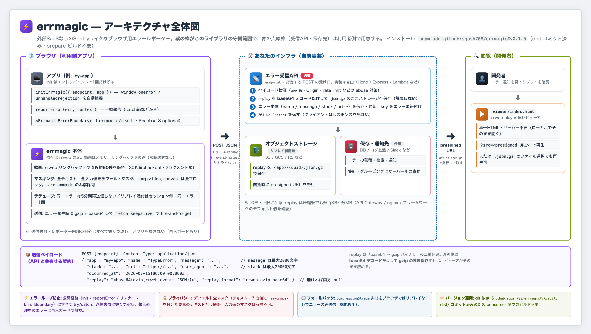

# errmagic

外部SaaSなしのSentryライクなブラウザ用エラーレポーター。ブラウザJSエラーを捕捉し、直近約60秒の rrweb セッションリプレイを添えて任意のエンドポイントへ POST します。`dist/` をコミットしているため、git 依存でそのまま `pnpm install` できます（prepare ビルド不要）。

## 全体アーキテクチャ

errmagic はクライアント（ブラウザ）側のライブラリです。**エラーの受け口となる API とリプレイの保存先はあなたのインフラで用意します**。



### 必要なインフラ

| コンポーネント | 必須 | 役割 |
|---|---|---|
| エラー受信API | ✅ | `endpoint` に指定する POST 受け口。後述の「API側でやること」を実装する |
| オブジェクトストレージ（S3 など） | リプレイを使うなら | `replay` を `.json.gz` として保存。ビューアは presigned URL で読む |
| エラー本体の保存先（DB / ログ基盤 / Slack 通知など） | 任意 | エラーの蓄積・検索・通知。方式は自由 |

サーバー・保存先のベンダーは問いません（S3 の部分は GCS / R2 等でも presigned URL 相当が発行できれば同じ構成が組めます）。

## インストール

```bash
pnpm add github:sgash708/errmagic#v0.1.0
```

React の ErrorBoundary（`errmagic/react`）を使う場合は `react >=18` が peerDependency（optional）です。

## 使い方

```ts
import { initErrmagic, reportError } from "errmagic";

initErrmagic({
  endpoint: "https://api.example.com/errors",
  app: "my-app",
  // replay?: boolean;              // default true
  // dedupeWindowMs?: number;       // default 300_000 (5分)
  // beforeSend?: (report) => report | null; // nullを返すと送信中止
});

// window.onerror / unhandledrejection は自動で捕捉されます。
// 手動で報告したい場合:
try {
  doSomething();
} catch (err) {
  reportError(err, { userId: "123" });
}
```

### React ErrorBoundary

```tsx
import { ErrmagicErrorBoundary } from "errmagic/react";

function App() {
  return (
    <ErrmagicErrorBoundary>
      <YourApp />
    </ErrmagicErrorBoundary>
  );
}
```

`fallback` prop を渡すとデフォルトの日本語簡易エラー画面（+再読み込みボタン）の代わりに任意の要素を表示できます。

## 送信ペイロード

```jsonc
POST {endpoint}  Content-Type: application/json
{
  "app": "my-app",
  "name": "TypeError",
  "message": "Cannot read ...",         // 最大2000文字に切り詰め
  "stack": "TypeError: ...\n at ...",   // 最大20000文字に切り詰め
  "url": "https://app.example.com/...",
  "user_agent": "Mozilla/...",
  "occurred_at": "2026-07-15T00:00:00.000Z",
  "replay": "<base64(gzip(JSON.stringify(rrweb events)))>", // 無い場合は null
  "replay_format": "rrweb-gzip-base64"                       // replayがnullならnull
}
```

## API側でやること

`endpoint` に指定する受信APIの責務です。

1. **ペイロードの受信・検証**: 上記 JSON を受け取り、`app` が想定するアプリ名かなどを検証する。
2. **replay の保存**: `replay` を **base64 デコードするとそのまま gzip バイナリ**になるので、解凍せず `.json.gz` としてオブジェクトストレージに保存する（ビューアが読める形式）。保存した key を エラーレコードに紐付けておく。
3. **エラー本体の保存・通知**: `name` / `message` / `stack` / `url` などを DB に保存したり、Slack 等に通知する（方式は自由）。
4. **レスポンス**: クライアントは fire-and-forget（レスポンスを見ない）ので、`204 No Content` を返せば十分。エラーを返してもリトライはされません。

```ts
// 実装例（Hono + AWS SDK v3）
app.post("/errors", async (c) => {
  const report = await c.req.json();
  if (report.app !== "my-app") return c.body(null, 400);

  let replayKey: string | null = null;
  if (report.replay) {
    replayKey = `${report.app}/${crypto.randomUUID()}.json.gz`;
    await s3.send(new PutObjectCommand({
      Bucket: "your-error-replay-bucket",
      Key: replayKey,
      Body: Buffer.from(report.replay, "base64"), // デコードするだけ。解凍しない
      ContentType: "application/gzip",
    }));
  }

  await db.insert(errors).values({ ...pick(report), replayKey });
  return c.body(null, 204);
});
```

### 運用上の注意

- **ボディサイズ上限**: `replay` は圧縮後でも数百KB〜数MBになり得ます。API側のリクエストボディ上限（API Gateway / nginx / フレームワークのデフォルト）を確認してください。超過時に 413 を返しても、クライアントはエラーになりません（握りつぶします）。
- **CORS**: アプリと別オリジンにエンドポイントを置く場合は、`POST` + `Content-Type: application/json` を許可する CORS 設定が必要です。
- **abuse 対策**: エンドポイントはブラウザから叩ける公開URLになるため、rate limit や `app` 名の検証、Origin チェックなどを入れることを推奨します。
- **重複**: クライアント側で5分デデュープしていますが、複数ユーザーが同じエラーを踏めばその数だけ届きます。集計・グルーピングはサーバー側の責務です。

## マスキング方針（プライバシー）

- **デフォルトで全テキスト・全入力値をマスクします**（`maskAllInputs: true` / `maskTextSelector: '*'`）。
- `img,video,canvas` はブロック対象（`blockSelector`）となり、リプレイに一切含まれません。
- テキストのマスクを解除したい要素にだけ `.rr-unmask` クラスを付与してください。それ以外は解除できません。
- 入力値（input/textarea等）のマスクは解除できません（`maskAllInputs: true` 固定）。

```html
<!-- このdiv配下のテキストのみマスクされずリプレイに残る -->
<div class="rr-unmask">公開して問題ない文言</div>
```

## その他の挙動

- 同一エラーはクライアント側で **5分間**（`dedupeWindowMs`）デデュープされ、再送信しません。
- リプレイの添付は **セッション毎・同一エラーにつき1回** のみ試行します（2回目以降はリプレイなしで送信）。
- `CompressionStream` 非対応ブラウザではリプレイを添付せずエラーのみ送信します。
- レポーター自身が例外を投げてアプリを壊すことはありません（送信失敗は握りつぶします）。

## リプレイビューア

`viewer/index.html` は rrweb-player（CDN）でリプレイをローカル再生するための単一HTMLです。サーバーは不要です。

1. ブラウザで `viewer/index.html` を直接開く
2. S3などに保存された replay に対して presigned URL を発行する

   ```bash
   aws s3 presign s3://your-error-replay-bucket/<key>
   ```

3. 発行されたURLを `?src=` に付けて開く

   ```
   viewer/index.html?src=<presigned URL>
   ```

   もしくはファイル選択（`.json.gz` 等）から読み込むことも可能です。

## 開発

```bash
pnpm install
pnpm test        # vitest
pnpm typecheck    # tsc --noEmit
pnpm build        # tsup（dist/ を再生成）
```

`dist/` はリポジトリにコミットされています。`src/` を変更したら `pnpm build` して `dist/` の差分もコミットしてください。
